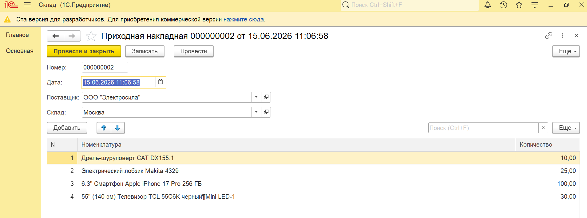
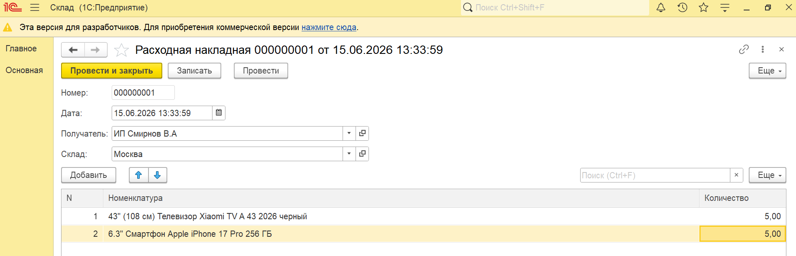
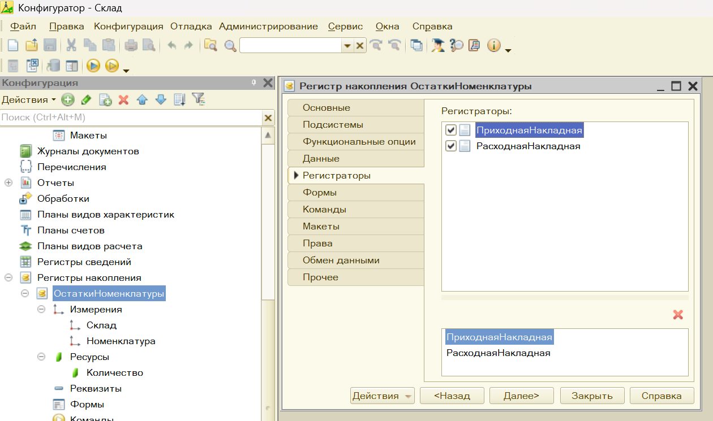
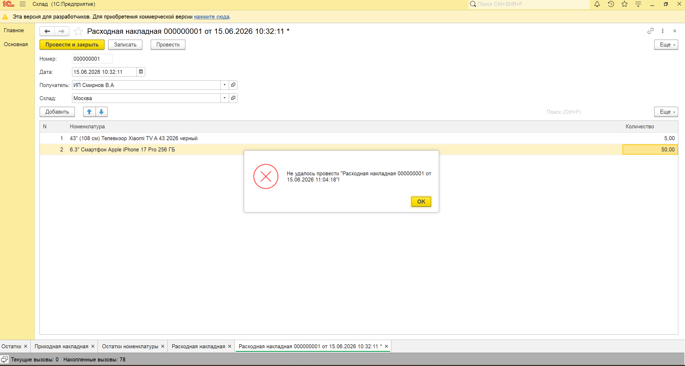
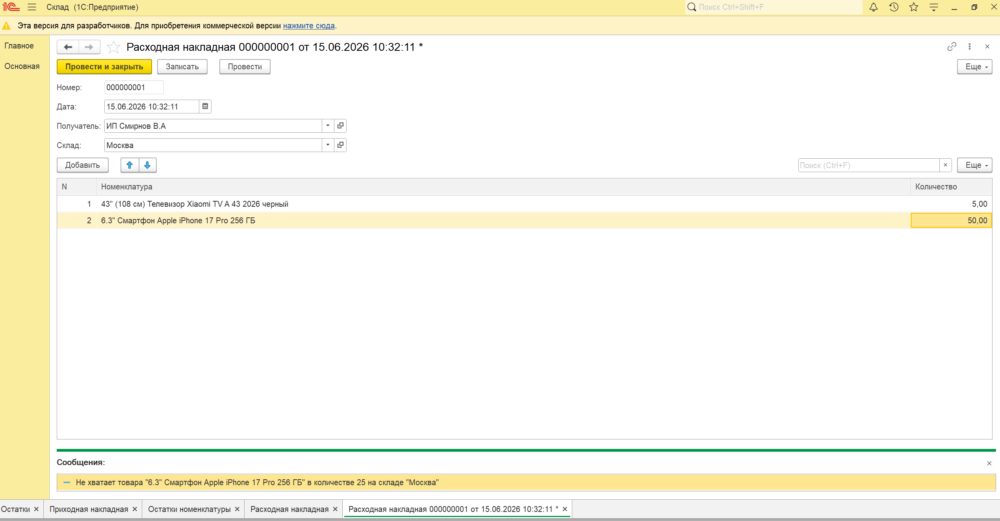
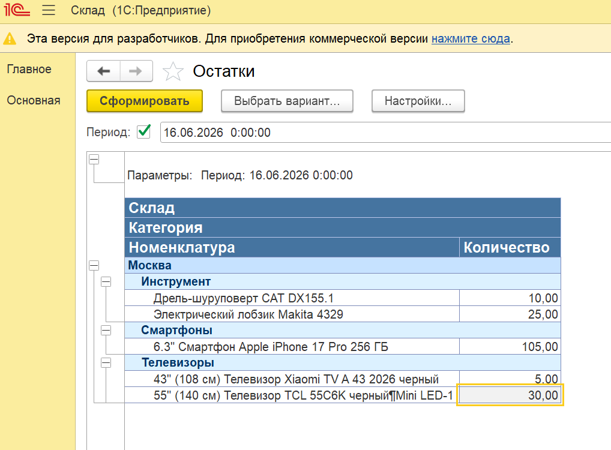
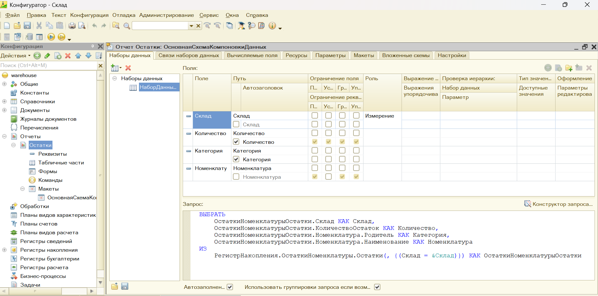
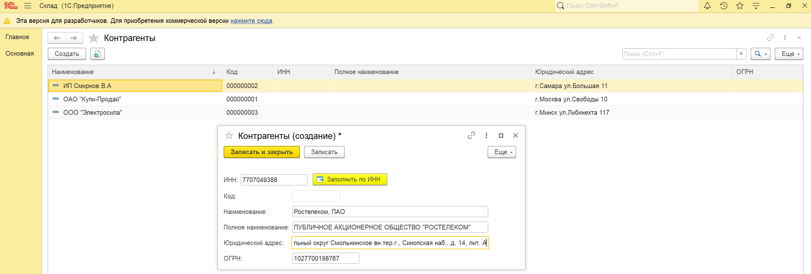

# warehouse - Учет остатков на складе

📌 Описание проекта

В проекте реализованы базовые процессы складского учета:

📥 поступление товаров
📤 списание товаров
📊 учет остатков через регистр накопления
🛑 контроль отрицательных остатков
📈 отчет по текущим остаткам
🔎 Автоматическое заполнение контрагента по ИНН

Проект демонстрирует навыки разработки прикладных решений на платформе 1С:Предприятие 8.3.

🚀 Функциональность
📥 Поступление товаров
- добавление товаров на склад указание количества
- формирование движений (приход)

📸 Скриншот:

📤 Расходная накладная
- списание товаров
- выбор склада
- контроль доступного количества

📸 Скриншот:

📊 Регистр накопления
ОстаткиНоменклатуры
Измерения:
- Номенклатура
- Склад
Ресурсы:
- Количество

📸 Скриншот:

🛑 Контроль отрицательных остатков
📌 Логика

При проведении расходной накладной:

- Формируются движения (расход)
- Выполняется запрос к регистру остатков
- Проверяются отрицательные значения

При нехватке — проведение отменяется
🔍 Реализация
виртуальная таблица:
- РегистрНакопления.ОстаткиНоменклатуры.Остатки
- использование Граница()
- фильтрация по складу и номенклатуре
💬 Ошибка
Не хватает товара "Товар" в количестве N на складе "Склад"

📸 Скриншот:

📈 Отчет: Остатки товаров

Реализован отчет для анализа текущих остатков товаров на складах.

⚙️ Возможности отчета
отображение остатков на текущий момент
группировка по:
- складу
- номенклатуре
- получение актуальных данных из регистра накопления

🔍 Техническая реализация
- используется запрос к:
РегистрНакопления.ОстаткиНоменклатуры.Остатки
- вывод данных в табличной форме
- расчет остатков на момент времени

📸 Скриншоты отчета:

🔎 Автоматическое заполнение контрагента по ИНН

Реализован функционал автоматического заполнения реквизитов справочника Контрагенты по введенному ИНН с использованием внешнего API (СБИС).

⚙️ Как это работает
- Пользователь вводит ИНН в форме контрагента
- По кнопке выполняется клиентская процедура
- На сервере выполняется HTTP-запрос к внешнему API
- Ответ в формате JSON обрабатывается и преобразуется в структуру 1С
- Полученные данные автоматически заполняют реквизиты формы

  
🧠 Архитектура решения
- Клиент-серверное взаимодействие (&НаКлиенте / &НаСервере)
- Использование HTTPСоединение для интеграции с API
- Работа с JSON через ЧтениеJSON и ПрочитатьJSON
- Обработка ошибок (сетевые ошибки, некорректный ответ)
- Преобразование данных API в структуру 1С
📡 Используемое API
- Сервис: СБИС API(demo - база)
- Формат данных: JSON
- Метод: GET-запрос по ИНН
📥 Заполняемые реквизиты

При успешном ответе автоматически заполняются:

- Наименование
- Полное наименование
- ОГРН
- Юридический адрес

🧠 Особенности реализации проекта
- использование регистров накопления
- работа с виртуальными таблицами
- написание запросов
- контроль бизнес-логики
- добавление аналитического отчета

🧩 Используемые объекты
📦 Справочники
- Товары
- Склады
Контрагенты
📄 Документы
- ПоступлениеТоваров
- РасходнаяНакладная
📊 Регистры
- ОстаткиНоменклатуры
📈 Отчеты
- ОстаткиТоваров
🛠️ Технологии
- 1С:Предприятие 8.3
- встроенный язык 1С
- язык запросов 1С

🎯 Что демонстрирует проект
- работа с регистрами накопления
- проведение документов
- контроль остатков
- написание запросов
- разработка отчетов
- понимание бизнес-логики учета

🚀 Возможные улучшения
- фильтры в отчете (по складу, дате)
- учет по партиям
- резервирование товаров
- расширенные аналитические отчеты
- автоматическое заполнение ИНН для Контрагента из стороннего ресурса

## 👨‍💻 Автор

Разработчик: Евгений Антонов Junior 1С Developer
